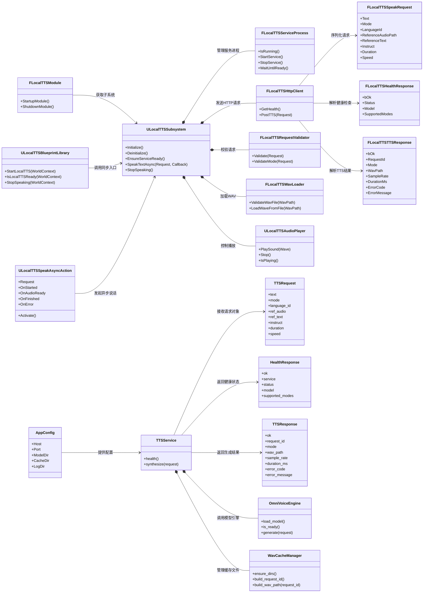

# 第一版类图设计

## 1. 设计目标

本文用于明确第一版 `LocalTTS` 插件与本地 `tts_service` 服务的核心类划分、职责边界和协作关系。

第一版坚持以下原则：

- 蓝图层只暴露简单入口，不直接处理服务细节
- UE 插件内部由一个总控类统一调度服务、请求、音频播放
- Python 服务端按“接口层 / 服务层 / 引擎层 / 配置层”拆分
- 当前以 `OmniVoice` 三种生成模式为主，不做流式播放

## 2. UML 类图



## 3. UE 插件侧类说明

### `FLocalTTSModule`

中文描述：
插件运行时模块入口。

职责：

- 跟随插件加载和卸载
- 负责模块生命周期初始化
- 不承载具体业务流程

### `ULocalTTSBlueprintLibrary`

中文描述：
提供给蓝图使用的同步函数入口。

职责：

- 暴露 `StartLocalTTS`
- 暴露 `IsLocalTTSReady`
- 暴露 `StopSpeaking`
- 将蓝图请求转交给 `ULocalTTSSubsystem`

### `ULocalTTSSpeakAsyncAction`

中文描述：
蓝图异步说话节点对象。

职责：

- 对应 `SpeakTextAsync`
- 保存蓝图传入的请求结构体
- 在 `Activate()` 中发起真正请求
- 向蓝图广播 `OnStarted`、`OnAudioReady`、`OnFinished`、`OnError`

### `ULocalTTSSubsystem`

中文描述：
第一版插件总控类，也是核心调度中心。

职责：

- 保管服务进程对象
- 保管 HTTP 客户端对象
- 保管请求校验对象
- 保管音频加载与播放对象
- 统一执行“检查服务 -> 校验请求 -> 请求生成 -> 加载 wav -> 播放 -> 回调”
- 屏蔽蓝图层对内部细节的感知

### `FLocalTTSServiceProcess`

中文描述：
本地 TTS 服务进程管理器。

职责：

- 检查服务是否运行
- 启动 `run_server.py`
- 等待服务通过健康检查
- 在需要时停止服务

### `FLocalTTSHttpClient`

中文描述：
本地 HTTP 请求封装器。

职责：

- 发送 `GET /health`
- 发送 `POST /tts`
- 统一设置超时和请求头
- 将 JSON 结果解析为 UE 内部数据结构

### `FLocalTTSRequestValidator`

中文描述：
请求结构校验器。

职责：

- 校验 `mode` 是否合法
- 校验 `clone` 模式下 `ReferenceAudioPath`
- 校验 `design` 模式下 `Instruct`
- 校验 `duration` 和 `speed`

### `FLocalTTSWavLoader`

中文描述：
WAV 文件验证与加载器。

职责：

- 检查服务返回的 `wav_path` 是否存在
- 校验文件是否可读
- 将 wav 文件转换为 UE 可播放音频对象

### `ULocalTTSAudioPlayer`

中文描述：
UE 音频播放控制器。

职责：

- 接收已加载的音频对象
- 在 UE 内触发播放
- 提供停止播放能力
- 监听播放完成并通知上层

### `FLocalTTSSpeakRequest`

中文描述：
UE 侧 TTS 请求数据结构。

职责：

- 封装文本内容
- 封装生成模式
- 封装语言 ID
- 封装参考音频路径
- 封装参考文本
- 封装音色描述
- 封装时长与语速

### `FLocalTTSHealthResponse`

中文描述：
UE 侧健康检查响应结构。

职责：

- 保存服务是否可用
- 保存服务状态
- 保存模型名称
- 保存支持模式列表

### `FLocalTTSTTSResponse`

中文描述：
UE 侧语音生成响应结构。

职责：

- 保存请求是否成功
- 保存请求编号
- 保存请求模式
- 保存生成的 wav 路径
- 保存采样率
- 保存耗时
- 保存错误码与错误信息

## 4. Python 服务侧类说明

### `AppConfig`

中文描述：
服务配置对象。

职责：

- 保存监听地址与端口
- 保存模型目录
- 保存缓存目录
- 保存日志目录

### `TTSRequest`

中文描述：
服务侧接收到的 TTS 请求结构。

职责：

- 校验 `text`
- 校验 `mode`
- 校验 `language_id`
- 校验 `ref_audio`
- 校验 `ref_text`
- 校验 `instruct`
- 校验 `duration`
- 校验 `speed`

### `HealthResponse`

中文描述：
服务健康检查返回结构。

职责：

- 返回服务名
- 返回当前状态
- 返回模型名
- 返回支持模式

### `TTSResponse`

中文描述：
服务语音生成返回结构。

职责：

- 返回是否成功
- 返回请求编号
- 返回请求模式
- 返回 wav 文件路径
- 返回采样率
- 返回耗时或错误信息

### `OmniVoiceEngine`

中文描述：
`OmniVoice` 模型引擎封装类。

职责：

- 加载 `OmniVoice`
- 检查模型是否就绪
- 根据 `auto`、`clone`、`design` 三种模式执行推理
- 输出原始音频结果给服务层

### `WavCacheManager`

中文描述：
WAV 缓存与命名管理器。

职责：

- 创建 `cache` 目录
- 生成递增或唯一的请求编号
- 根据请求编号生成 wav 文件路径

### `TTSService`

中文描述：
服务业务总控类。

职责：

- 响应健康检查
- 接收并处理 TTS 请求
- 调用 `OmniVoiceEngine`
- 调用 `WavCacheManager`
- 组织最终响应结构

## 5. 第一版调用链

```text
蓝图
 -> ULocalTTSSpeakAsyncAction
 -> ULocalTTSSubsystem
 -> FLocalTTSRequestValidator
 -> FLocalTTSServiceProcess
 -> FLocalTTSHttpClient
 -> Python TTSService
 -> OmniVoiceEngine
 -> 返回 wav_path
 -> FLocalTTSWavLoader
 -> ULocalTTSAudioPlayer
 -> 蓝图回调完成
```

## 6. 第一版建议优先创建的类

UE 插件侧：

- `FLocalTTSModule`
- `ULocalTTSBlueprintLibrary`
- `ULocalTTSSpeakAsyncAction`
- `ULocalTTSSubsystem`
- `FLocalTTSServiceProcess`
- `FLocalTTSHttpClient`
- `FLocalTTSRequestValidator`
- `FLocalTTSWavLoader`
- `ULocalTTSAudioPlayer`
- `LocalTTSDataTypes`

Python 服务侧：

- `AppConfig`
- `TTSRequest`
- `HealthResponse`
- `TTSResponse`
- `OmniVoiceEngine`
- `WavCacheManager`
- `TTSService`
