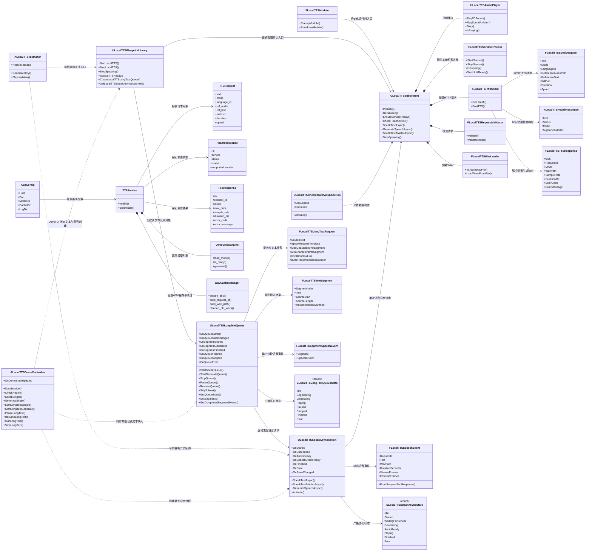

# 当前类图设计

## 1. 设计目标

本文用于描述当前 `LocalTTS` 插件与本地 `tts_service` 服务的真实类结构，重点服务以下目标：

- 让蓝图调用入口、异步节点、长文本队列、服务调度关系一眼可读
- 让新增成员能够先看类图，再进代码定位文件
- 让“正式入口”和“示例入口”边界清晰，避免继续把测试 Actor 当成产品接口
- 为后续字幕、数字人、口型和长文本扩展保留稳定骨架

## 2. 命名约定

当前仓库继续执行“类型名即文件名”的约定，便于团队直接从类图跳到代码：

- `UCLASS`：类名就是头文件名，源码实现文件与类名保持一致
- `USTRUCT`：结构体名就是头文件名
- `UENUM`：枚举名就是头文件名
- 普通 C++ 类：类名就是头文件名，`.cpp` 也保持同名

示例：

- `ULocalTTSLongTextQueue` -> `ULocalTTSLongTextQueue.h` / `ULocalTTSLongTextQueue.cpp`
- `FLocalTTSLongTextRequest` -> `FLocalTTSLongTextRequest.h`
- `FLocalTTSTextSegment` -> `FLocalTTSTextSegment.h`
- `ELocalTTSSpeakAsyncState` -> `ELocalTTSSpeakAsyncState.h`
- `ALocalTTSTestActor` -> `ALocalTTSTestActor.h` / `ALocalTTSTestActor.cpp`
- `ALocalTTSDemoController` -> `ALocalTTSDemoController.h` / `ALocalTTSDemoController.cpp`

说明：

- 这个约定适用于插件主类型、宿主工程示例类型、服务端主类文档命名
- 非类型文件例如 `LocalTTS.Build.cs`、资源文件、批处理文件不在此约定范围内

## 3. UML 类图

## 4. UE 插件侧说明

### 4.1 正式入口层

| 类型 | 文件 | 中文说明 |
| --- | --- | --- |
| `ULocalTTSBlueprintLibrary` | `ULocalTTSBlueprintLibrary.h/.cpp` | 正式蓝图函数库，提供启动服务、停止播放、创建长文本队列、读取 UI 状态文本等稳定入口。 |
| `ULocalTTSCheckHealthAsyncAction` | `ULocalTTSCheckHealthAsyncAction.h/.cpp` | 单独负责 `/health` 异步检查，适合启动页、设置页、调试页轮询服务状态。 |
| `ULocalTTSSpeakAsyncAction` | `ULocalTTSSpeakAsyncAction.h/.cpp` | 单次语音异步节点，统一封装“等待服务 -> 生成 -> 音频就绪 -> 播放/结束 -> 错误”。 |

### 4.2 长文本与数字人预留层

| 类型 | 文件 | 中文说明 |
| --- | --- | --- |
| `FLocalTTSLongTextRequest` | `FLocalTTSLongTextRequest.h` | 长文本任务输入，保存原始长文本、请求模板和分段策略。 |
| `FLocalTTSTextSegment` | `FLocalTTSTextSegment.h` | 单个文本段结构，记录段序号、文本内容、原文范围和推荐时长。 |
| `FLocalTTSSegmentSpeechEvent` | `FLocalTTSSegmentSpeechEvent.h` | 把段信息和该段对应的语音事件组合在一起，便于字幕、数字人和时间线系统直接消费。 |
| `ULocalTTSLongTextQueue` | `ULocalTTSLongTextQueue.h/.cpp` | 长文本队列控制器，当前负责分段、逐段生成、顺序播放、暂停、继续、跳到下一段和统一状态广播。 |
| `FLocalTTSSpeechEvent` | `FLocalTTSSpeechEvent.h` | 语音事件统一结构，除文本和 wav 外，还预留口型帧、表情帧等后续扩展位。 |
| `ELocalTTSSpeakAsyncState` | `ELocalTTSSpeakAsyncState.h` | 单次请求状态枚举，正式 UI 推荐直接基于该枚举更新“思考中 / 生成中 / 播放中”。 |
| `ELocalTTSLongTextQueueState` | `ELocalTTSLongTextQueueState.h` | 长文本队列状态枚举，用于控制分段、生成、播放、暂停、停止、完成和错误状态。 |

### 4.3 核心调度层

| 类型 | 文件 | 中文说明 |
| --- | --- | --- |
| `ULocalTTSSubsystem` | `ULocalTTSSubsystem.h/.cpp` | 插件总控中心，统一管理服务状态、请求发送、WAV 加载和播放调度。 |
| `FLocalTTSServiceProcess` | `FLocalTTSServiceProcess.h/.cpp` | 负责启动、停止和探测本地 Python 服务进程。 |
| `FLocalTTSHttpClient` | `FLocalTTSHttpClient.h/.cpp` | 负责 `/health` 和 `/tts` 的 HTTP 请求与 JSON 解析。 |
| `FLocalTTSRequestValidator` | `FLocalTTSRequestValidator.h/.cpp` | 在请求发给服务前做本地参数校验，尽早给出可读错误。 |
| `FLocalTTSWavLoader` | `FLocalTTSWavLoader.h/.cpp` | 对服务端生成的 WAV 文件做存在性、格式和可加载性检查。 |
| `ULocalTTSAudioPlayer` | `ULocalTTSAudioPlayer.h/.cpp` | 负责 2D/3D 播放、停止播放和播放完成回调。 |

### 4.4 数据结构层

| 类型 | 文件 | 中文说明 |
| --- | --- | --- |
| `FLocalTTSSpeakRequest` | `FLocalTTSSpeakRequest.h` | 蓝图和 C++ 共同使用的单次语音请求结构。 |
| `FLocalTTSTTSResponse` | `FLocalTTSTTSResponse.h` | 服务端 `/tts` 返回结果结构。 |
| `FLocalTTSHealthResponse` | `FLocalTTSHealthResponse.h` | 服务端 `/health` 返回结果结构。 |

### 4.5 示例层

| 类型 | 文件 | 中文说明 |
| --- | --- | --- |
| `ALocalTTSTestActor` | `ALocalTTSTestActor.h/.cpp` | 编辑器测试和演示用 Actor，用来展示按钮、中文提示、播放复用逻辑和调试字段，不作为正式产品入口。 |
| `ALocalTTSDemoController` | `ALocalTTSDemoController.h/.cpp` | 轻量 Demo UI 和关卡使用的桥接 Actor，集中保存按钮操作、状态文本、最近结果和事件日志，方便 Widget 只做显示与调用。 |

## 5. Python 服务侧说明

| 类型 | 文件 | 中文说明 |
| --- | --- | --- |
| `AppConfig` | `Services/tts_service/app/AppConfig.py` | 服务配置对象，负责 host、port、缓存目录、日志目录等基础参数。 |
| `TTSRequest` | `Services/tts_service/app/schemas` 相关文件 | `/tts` 接口请求结构。 |
| `HealthResponse` | `Services/tts_service/app/schemas` 相关文件 | `/health` 接口响应结构。 |
| `TTSResponse` | `Services/tts_service/app/schemas` 相关文件 | `/tts` 接口响应结构。 |
| `OmniVoiceEngine` | `Services/tts_service/app` 相关文件 | 模型引擎封装，负责加载模型和执行推理。 |
| `WavCacheManager` | `Services/tts_service/app/WavCacheManager.py` | 生成请求编号、输出 wav 路径，并清理旧缓存。 |
| `TTSService` | `Services/tts_service/app/TTSService.py` | 服务总控类，串起配置、模型、缓存与接口层。 |

## 6. 当前推荐阅读顺序

新同学建议按下面顺序阅读：

1. 先看本文件，了解正式入口、长文本骨架、服务关系。
2. 再看 `10_插件产品化计划.md`，理解当前产品化推进阶段。
3. 需要接 UI 时，重点看 `ULocalTTSSpeakAsyncAction`、`ELocalTTSSpeakAsyncState`、`ULocalTTSBlueprintLibrary`。
4. 需要接长文本、字幕、数字人时，重点看 `FLocalTTSLongTextRequest`、`ULocalTTSLongTextQueue`、`FLocalTTSSegmentSpeechEvent`。
5. 需要排查服务问题时，再看 `09_服务骨架类图设计.md` 和 `Services/tts_service`。
