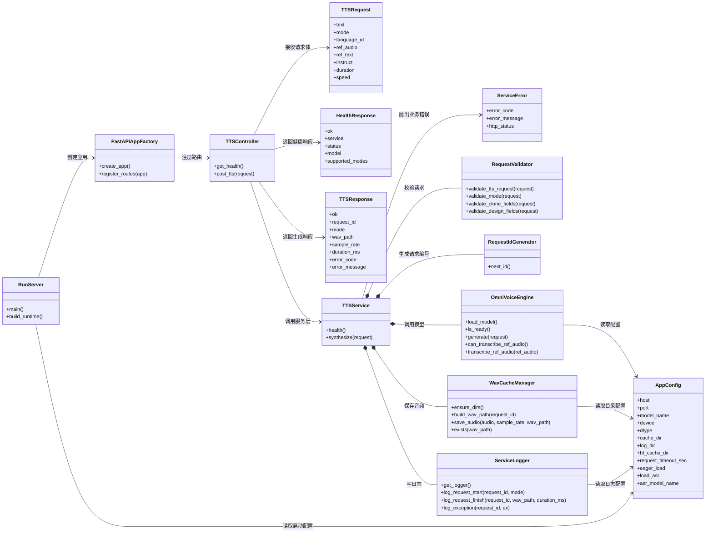

# 服务骨架类图设计

## 1. 设计目标

本文用于明确 `Services/tts_service` 第一版服务骨架的类划分、职责边界和调用关系。

本设计只关注服务端内部，不包含 UE 插件侧类。

设计原则：

- 接口层、服务层、模型层、基础设施层分离
- 协议对象和业务对象分开定义
- `OmniVoice` 调用逻辑集中在单一引擎类
- 文件缓存、日志、配置、请求校验都有独立职责
- UE 插件只依赖稳定本地 HTTP 协议，不直接依赖模型内部实现

## 2. 服务骨架 UML 类图



## 3. 类说明

### `AppConfig`

中文描述：
服务配置对象。

所在文件：

- `Services/tts_service/app/AppConfig.py`

职责：

- 保存监听地址和端口
- 保存模型名称
- 保存运行设备和精度配置
- 保存缓存目录和日志目录
- 保存 Hugging Face 缓存目录
- 保存是否启动即预热模型
- 保存是否启用 ASR 及 ASR 模型名称

### `TTSRequest`

中文描述：
语音生成请求结构。

所在文件：

- `Services/tts_service/app/TTSRequest.py`

职责：

- 表达 `/tts` 请求体
- 作为接口层和服务层的统一输入对象
- 承载 `auto`、`clone`、`design` 三种模式参数
- 为 `clone` 模式保留 `ref_audio` 与 `ref_text`
- 为 `design` 模式保留 `instruct`

### `HealthResponse`

中文描述：
健康检查响应结构。

所在文件：

- `Services/tts_service/app/HealthResponse.py`

职责：

- 表达 `/health` 成功响应
- 返回模型状态和支持模式

### `TTSResponse`

中文描述：
语音生成响应结构。

所在文件：

- `Services/tts_service/app/TTSResponse.py`

职责：

- 表达 `/tts` 成功或失败响应
- 返回生成结果路径、采样率、耗时、错误信息

### `ServiceError`

中文描述：
服务内部业务异常对象。

所在文件：

- `Services/tts_service/app/ServiceError.py`

职责：

- 统一承载错误码和错误信息
- 让控制器层可以稳定映射成 HTTP 响应
- 为插件侧提供稳定失败语义

### `RequestValidator`

中文描述：
请求校验器。

所在文件：

- `Services/tts_service/app/RequestValidator.py`

职责：

- 校验公共字段
- 校验 `mode`
- 校验 `clone` 模式必填字段
- 校验 `design` 模式必填字段
- 校验 `duration` 和 `speed`
- 拦截空白 `language_id` 与非法参考音频路径

### `RequestIdGenerator`

中文描述：
请求编号生成器。

所在文件：

- `Services/tts_service/app/RequestIdGenerator.py`

职责：

- 生成唯一请求编号
- 为缓存命名和日志追踪提供统一 ID

### `WavCacheManager`

中文描述：
WAV 缓存管理器。

所在文件：

- `Services/tts_service/app/WavCacheManager.py`

职责：

- 创建 `cache` 目录
- 根据请求编号生成 wav 路径
- 保存生成后的音频文件
- 检查输出文件是否存在

### `OmniVoiceEngine`

中文描述：
`OmniVoice` 模型引擎封装类。

所在文件：

- `Services/tts_service/app/OmniVoiceEngine.py`

职责：

- 加载模型
- 检查模型是否就绪
- 根据请求模式调用 `generate`
- 暴露 ASR 是否可用
- 在 `clone` 模式下必要时转写参考音频
- 在 ASR 预热失败时降级为无 ASR 模式继续提供 TTS

### `TTSService`

中文描述：
服务业务总控类。

所在文件：

- `Services/tts_service/app/TTSService.py`

职责：

- 响应健康检查
- 调用校验器检查请求
- 生成请求编号
- 在 `clone` 模式下补齐 `ref_text` 或拒绝缺失请求
- 调用模型生成音频
- 将音频保存为 wav
- 组织最终响应结构

### `ServiceLogger`

中文描述：
服务日志管理器。

所在文件：

- `Services/tts_service/app/ServiceLogger.py`

职责：

- 初始化服务日志
- 记录请求开始与结束
- 记录生成结果路径和耗时
- 记录异常信息

### `TTSController`

中文描述：
HTTP 控制器层。

所在文件：

- `Services/tts_service/app/TTSController.py`

职责：

- 对接 FastAPI 路由
- 接收并解析请求对象
- 调用 `TTSService`
- 返回统一响应

### `FastAPIAppFactory`

中文描述：
FastAPI 应用工厂。

所在文件：

- `Services/tts_service/app/FastAPIAppFactory.py`

职责：

- 创建 FastAPI 应用对象
- 注册健康检查和 TTS 路由
- 组装服务依赖
- 在生命周期钩子中触发目录初始化和可选预热

### `RunServer`

中文描述：
服务启动入口。

所在文件：

- `Services/tts_service/app/RunServer.py`
- `Services/tts_service/run_server.py`

职责：

- 读取启动配置
- 构建服务运行依赖
- 启动 HTTP 服务

## 4. 调用链

```text
run_server.py
 -> app/RunServer.py
 -> RunServer
 -> FastAPIAppFactory
 -> TTSController
 -> TTSService
 -> RequestValidator
 -> RequestIdGenerator
 -> OmniVoiceEngine
 -> WavCacheManager
 -> TTSResponse
```

## 5. 最小服务职责边界

第一版本地服务只负责以下边界内的事情：

- 启动和保活本地 HTTP 服务
- 维护 `GET /health` 与 `POST /tts` 两个稳定接口
- 加载 `OmniVoice` 并管理模型预热
- 接收统一 JSON 协议并映射为内部请求对象
- 生成请求编号、日志和 wav 缓存路径
- 在离线或 ASR 不可用时执行明确降级策略

第一版明确不负责：

- 直接暴露 `OmniVoice` 原生 Gradio 界面给 UE 调用
- 把模型内部参数直接透传成不稳定外部协议
- 流式音频分片返回
- viseme、口型或 MetaHuman 驱动数据
- 复杂任务队列、分布式调度或远程多机推理

## 6. 离线与 ASR 降级规则

- 启动时优先按 `load_asr=true` 尝试加载 `OmniVoice` 与 ASR
- 如果主模型可加载但 ASR 因离线或缓存缺失失败，则服务降级为“可合成、不可自动转写”
- 降级后 `/health` 仍可返回 `ready`，因为基础 TTS 能力可用
- `clone` 模式下若未提供 `ref_text`，仅在 ASR 可用时允许服务侧自动转写
- `clone` 模式下若 ASR 不可用，则 `ref_text` 视为必填

## 7. 类与文件映射总览

按“一个文件里放哪些类”来看，当前骨架是这样组织的：

- `Services/tts_service/app/AppConfig.py`
  - `AppConfig`
- `Services/tts_service/app/TTSRequest.py`
  - `TTSRequest`
- `Services/tts_service/app/HealthResponse.py`
  - `HealthResponse`
- `Services/tts_service/app/TTSResponse.py`
  - `TTSResponse`
- `Services/tts_service/app/ServiceError.py`
  - `ServiceError`
- `Services/tts_service/app/RequestValidator.py`
  - `RequestValidator`
- `Services/tts_service/app/RequestIdGenerator.py`
  - `RequestIdGenerator`
- `Services/tts_service/app/WavCacheManager.py`
  - `WavCacheManager`
- `Services/tts_service/app/ServiceLogger.py`
  - `ServiceLogger`
- `Services/tts_service/app/OmniVoiceEngine.py`
  - `OmniVoiceEngine`
- `Services/tts_service/app/TTSService.py`
  - `TTSService`
- `Services/tts_service/app/TTSController.py`
  - `TTSController`
- `Services/tts_service/app/FastAPIAppFactory.py`
  - `FastAPIAppFactory`
- `Services/tts_service/app/RunServer.py`
  - `RunServer`
- `Services/tts_service/run_server.py`
  - 启动入口脚本

## 8. 推荐阅读顺序

如果你是第一次读这套代码，建议按下面顺序看：

1. `run_server.py`
2. `app/TTSController.py`
3. `app/FastAPIAppFactory.py`
4. `app/TTSService.py`
5. `app/TTSRequest.py`
6. `app/TTSResponse.py`
7. `app/RequestValidator.py`
8. `app/OmniVoiceEngine.py`
9. `app/WavCacheManager.py`
10. `app/ServiceLogger.py`
11. `app/AppConfig.py`
12. `app/ServiceError.py`
13. `app/RequestIdGenerator.py`
14. `app/RunServer.py`

这样阅读会更贴近真实调用链：

`RunServer -> FastAPIAppFactory -> TTSController -> TTSService -> OmniVoiceEngine / WavCacheManager / ServiceLogger`

## 9. 第一版建议落地文件

- `app/AppConfig.py`
- `app/HealthResponse.py`
- `app/FastAPIAppFactory.py`
- `app/OmniVoiceEngine.py`
- `app/RequestIdGenerator.py`
- `app/RequestValidator.py`
- `app/ServiceError.py`
- `app/ServiceLogger.py`
- `app/TTSController.py`
- `app/TTSRequest.py`
- `app/TTSResponse.py`
- `app/TTSService.py`
- `app/WavCacheManager.py`
- `app/RunServer.py`
- `run_server.py`
